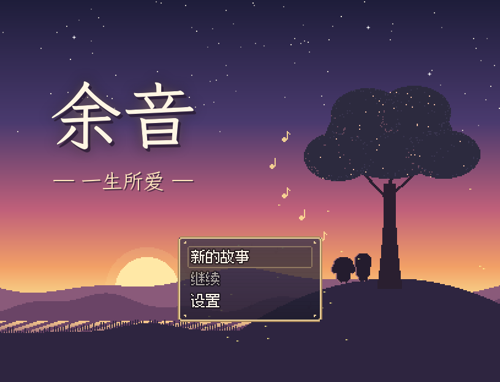
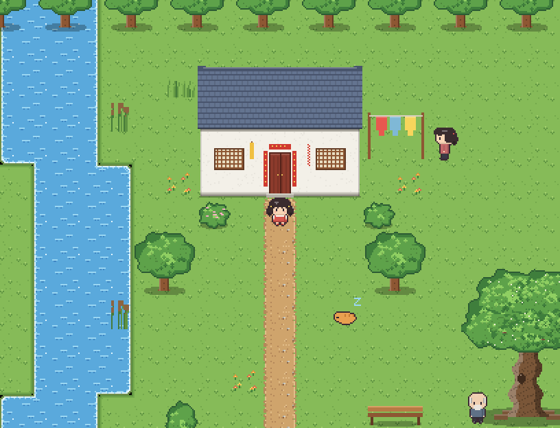
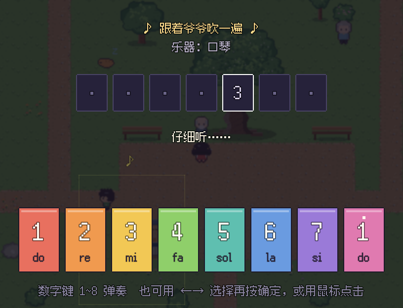
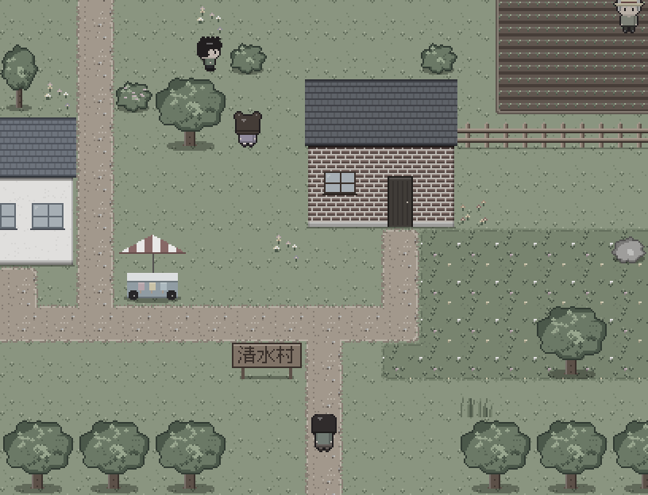
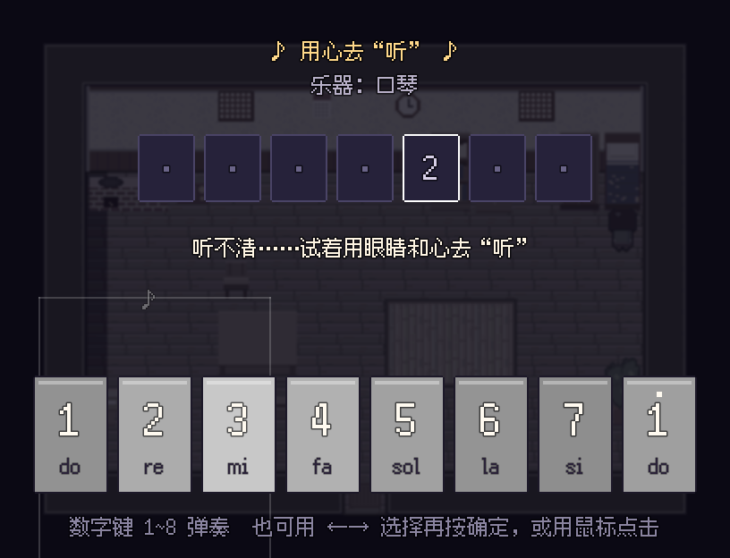
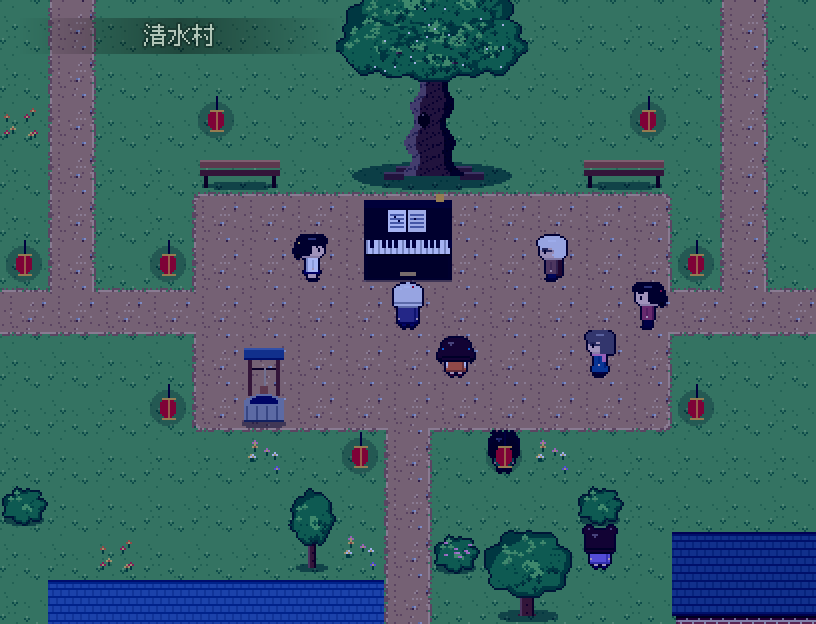

# 余音 —— 一生所爱

一款用 **RPG Maker MV** 制作的剧情 RPG：一个女孩用一辈子，写完一首歌。

> 喜欢一样东西，不用谁来批准，也不用急着它能换来什么。
> 你只要一直喜欢下去，它就会一直陪着你。



## 这是什么

主角 **林音** 的一生被分成 5 个章节——8 岁、16 岁、25 岁、45 岁、78 岁。
每个人生阶段，她都会学会主旋律里的**一句**，而这一句需要**你亲手弹出来**。
童年的蝉鸣、少年的逆风、城市的霓虹、失聪后的心跳……最后，在老槐树下的音乐会上，由你写下这首歌的**最后一句**。

| 第一章「蝉鸣」8 岁 | 旋律小游戏 | 第三章「霓虹」25 岁 |
| --- | --- | --- |
|  |  |  |
| **第四章「无声」45 岁** | **用眼睛“听”** | **第五章「余音」78 岁** |
|  |  |  |

- 5 个章节 + 序章，约 30～40 分钟，无战斗
- 12 次旋律小游戏：跟着弹、用眼睛听、自由创作
- 全部美术（像素图块、33 个角色、界面）和全部音乐（11 首编曲 + 音效）都是本项目原创，由 `tools/` 里的程序生成
- 带名字框的对话、章节标题卡、记录人生的菜单

## 怎么玩 / 怎么改

**完全没用过 RPG Maker？** 请看 👉 [docs/新手教程.md](docs/新手教程.md)

最快的方式：
1. 安装 RPG Maker MV（Steam），菜单 **文件 → 打开项目**，选择 `YuYin/Game.rpgproject`。
2. 按 **Ctrl + R** 试玩。方向键/鼠标移动，Z/回车对话，**数字键 1～8 弹琴**。

不装 RPG Maker 也能玩：在本文件夹运行 `python -m http.server --directory YuYin 8080`，然后用浏览器打开 <http://localhost:8080>。

## 文档

| 文件 | 内容 |
| --- | --- |
| [docs/策划案.md](docs/策划案.md) | 设计思路、故事梗概、人物、玩法、音乐与美术、流程图、开关/变量速查 |
| [docs/剧本.md](docs/剧本.md) | 全部台词（从游戏数据自动导出） |
| [docs/新手教程.md](docs/新手教程.md) | 零基础：打开、试玩、改台词、加人物、做小游戏、画地图、发布 |

## 项目结构

```
YuYin/                      RPG Maker MV 项目（用编辑器打开这里的 Game.rpgproject）
  data/                     地图、事件、数据库
  img/  audio/  fonts/      图片、声音、字体
  js/plugins/LifeSong.js    本游戏的插件（旋律小游戏、标题卡、名字框、菜单）
docs/                       策划案、剧本、新手教程、截图
tools/                      生成素材和数据的程序（进阶，可忽略）
  art/      像素画生成（图块、角色、界面、标题）
  audio/    音乐合成（合成器 + 简谱编曲）
  build/    地图与剧情事件 → data/*.json
  test/     静态检查 + 无头浏览器自动通关测试
```

> ⚠️ 在 RPG Maker 编辑器里改过游戏以后，**不要再运行** `tools/build/build_data.py`，它会覆盖你的修改。

### 给开发者：重新生成与测试

```bash
python3 tools/art/build_art.py          # 图片（需要 numpy, pillow, fonttools）
python3 tools/audio/build_audio.py      # 音乐与音效（需要 numpy, ffmpeg）
python3 tools/build/build_data.py       # 地图、事件、数据库
python3 tools/build/export_script.py    # 导出 docs/剧本.md
python3 tools/test/validate.py          # 静态检查：事件结构、文件引用、可达性
node tools/test/playthrough.js --shots  # 无头 Chromium 自动通关（需要 playwright）
```

## 致谢与许可

- 引擎脚本：[RPG Maker MV Corescript](https://github.com/rpgtkoolmv/corescript)（MIT，见 `YuYin/js/LICENSE-corescript.txt`）
- 字体：[Fusion Pixel Font](https://github.com/TakWolf/fusion-pixel-font)（SIL OFL 1.1，见 `YuYin/fonts/FusionPixel-LICENSE-OFL.txt`）
- 剧本、像素美术、音乐、插件：本项目原创
