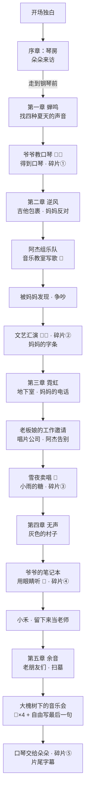

# 《余音》策划案

> **一句话**：一个女孩用一辈子写完一首歌的故事。
> **主题**：热爱。不是“成功”，而是“放不下”——喜欢一样东西，不用谁来批准，也不用它换来什么。
> **类型**：剧情向 RPG（无战斗），约 30～40 分钟通关。
> **引擎**：RPG Maker MV（项目文件夹 `YuYin/`）

---

## 1. 设计目标：让玩家“亲手”热爱一次

很多故事讲“热爱”，都是让主角说出来。《余音》想让玩家**自己做出来**：

| 设计 | 它在表达什么 |
| --- | --- |
| 主角的一生分成 5 个年龄段，每一段都学会主旋律里的**一句** | 热爱不是一瞬间，而是一辈子一点一点攒起来的 |
| 每一句都要玩家**亲手弹出来**（旋律小游戏） | 热爱需要练习、会弹错、会重来 |
| 弹错了不会失败，只会“再听一遍”，错两次就给简谱提示 | 热爱从来不考试，只要你还想继续 |
| 第四章耳朵听不见了，小游戏几乎没有声音，只能**看**琴键震动 | 失去了最重要的东西，热爱还在——“音乐不在耳朵里，在心里” |
| 终章最后一句旋律，**由玩家自由创作** | 这首歌的结尾，属于每一个玩游戏的人 |
| 最后把爷爷的口琴交给下一个孩子，她吹出了第一章的那一句 | 热爱会传下去，这就是“余音” |

---

## 2. 故事梗概

主角 **林音**（小名“小音”），1990 年出生在城里，童年的暑假在乡下 **清水村** 的爷爷家度过。

### 序章「黄昏」· 78 岁 · 2068 年秋
清水村的老房子里，白发的林音在为明天的“大槐树下的音乐会”做准备。邻居家的小女孩 **朵朵** 问她要弹什么——“一首我写了一辈子的歌，还差最后一句。”林音坐到钢琴前，回忆开始。

### 第一章「蝉鸣」· 8 岁 · 1998 年夏
- 小音被送到爷爷家过暑假，被门外的口琴声吸引。
- 爷爷 **林守山** 在老槐树下吹口琴。他不急着教，而是让小音先去“听”：找到四种 **夏天的声音**——知了、小河、李奶奶的风铃、冰棍车的铃铛。
- 找齐以后，爷爷教她吹第一句（**旋律小游戏**），并把吹了五十年的口琴送给她。
- 夕阳下，爷爷说出整部作品的核心台词：
  > “喜欢一样东西，不用谁来批准，也不用急着它能换来什么。你只要一直喜欢下去，它就会一直陪着你。”
- 获得旋律碎片 ①「蝉鸣」`3 5 6 5 3 2 1`

### 第二章「逆风」· 16 岁 · 2006 年秋
- 爷爷去世。李奶奶寄来包裹：一把爷爷攒了一年钱买的旧吉他，和字条“口琴太小了，快装不下你的歌了”。
- 妈妈反对：“你爷爷吹了一辈子口琴，吹出什么名堂了？”（**选择**：顺从／小声反驳）
- 同学 **阿杰** 邀请她组乐队参加文艺汇演，她在音乐教室写出第二句（小游戏），歌名叫《逆风》。
- 妈妈发现她逃了补习班，争吵（**选择**）。林音说出：“他吹出了我啊。”
- 文艺汇演上她第一次登台（两个小游戏）。礼堂最后一排，站着妈妈。
- 当晚，桌上有一副新琴弦和字条：“琴弦旧了，换一副吧。——妈”
- 获得旋律碎片 ②「逆风」`2 3 5 6 5 3 2`

### 第三章「霓虹」· 25 岁 · 2015 年冬
- 大城市的地下室，泡面、三十七张没有回音的小样。妈妈打来电话，她说“挺好的”。
- 咖啡馆老板娘介绍一份朝九晚五的工作（**选择**：去上班／再坚持一年——两种都不是错，结尾旁白会不同）。
- 唱片公司的前台身后，堆满了没拆封的 CD。
- 阿杰穿上西装来告别：“我没有你那么喜欢。”留下一枚拨片。
- 雪夜，地铁口卖唱，没有一个人停下来。正要放弃时，一个叫 **小雨** 的小女孩拉住了妈妈：“我想听姐姐唱歌。”林音为她唱了第三句（小游戏）。小雨把最喜欢的粉色的糖放进琴盒。
  > “就算只有一个人在听，也值得。”
- 获得旋律碎片 ③「霓虹」`6 1̇ 6 5 3 5 6`

### 第四章「无声」· 45 岁 · 2035 年春
- 已经是职业作曲人的林音，突发性耳聋。她回到清水村——**画面变成灰色，背景音像隔着一层水**，村民的话都听不清。
- 在爷爷的床底下，她找到爷爷的笔记本：爷爷晚年在矿上干活，耳朵也坏了，“可是不要紧，口琴贴在嘴唇上，我能感觉到它在抖……音乐不光是用耳朵听的，是用心。”
- **“用眼睛听”的小游戏**：示范几乎没有声音，只能看琴键的波纹去跟。弹完以后，**世界的颜色回来了**。
- 树下有个叫 **小禾** 的女孩一个人哼歌，“妈妈说哼这个没用”。林音把爷爷的话送给了她，并答应留在村小当音乐老师。
- 获得旋律碎片 ④「心跳」`5 3 2 1 2 3 1`

### 第五章「余音」· 78 岁 · 2068 年秋（回到序章的第二天）
- 傍晚，大槐树下挂满灯笼。来了很多人：成为音乐老师的 **小禾**、退休后重新拿起吉他的 **阿杰**、当了医生的 **小雨**（她来“还那颗糖”）。
- 山坡上，爷爷和妈妈的墓。“后来我的每一场演出，你都来了，总是坐在最后一排。这一次，你们俩坐在第一排好不好？”
- **音乐会**：玩家依次弹出人生的四句，最后用 **自由演奏** 写下属于自己的最后一句，然后整首歌被完整弹奏一遍。
- 朵朵再问：“您现在想明白了吗？为什么一辈子都放不下它？”——“因为喜欢啊。”
- 林音把爷爷的口琴交给朵朵，朵朵吹出了第一章的那一句。
- 获得旋律碎片 ⑤「余音」，片尾字幕：**“愿你也有一样东西，可以热爱一辈子。”**

---

## 3. 人物

| 角色 | 出场 | 行走图文件 | 一句话 |
| --- | --- | --- | --- |
| 林音（主角） | 全部 | `$Yin_Child` `$Yin_Teen` `$Yin_Adult` `$Yin_Middle` `$Yin_Old` | 一辈子都放不下音乐的人 |
| 爷爷 林守山 | 一 | `$Grandpa` | 矿工，吹了五十年口琴，热爱的源头 |
| 妈妈 | 二、三（电话） | `$Mom` | 不是反派。她的爱是担心，最后用一副琴弦道歉 |
| 阿杰 | 二、三、五 | `$Jie_Teen` `$Jie_Adult` `$Jie_Old` | “我没有你那么喜欢”——但老了以后，他又拿起了吉他 |
| 王老师 | 二 | `$Teacher_Wang` | 借出音乐教室的人 |
| 小雨 | 三、五 | `$Xiaoyu_Child` `$Xiaoyu_Adult` | 雪夜里唯一停下来的听众 |
| 小禾 | 四、五 | `$Xiaohe_Child` `$Xiaohe_Adult` | 被“允许”去喜欢的孩子，后来成了老师 |
| 朵朵 | 序、五 | `$Duoduo` | 下一个接过口琴的人（和 8 岁的林音长得很像） |
| 李奶奶、王伯、张婶、渔夫、卖冰棍的…… | 一、四、五 | `$Granny_Li` 等 | 清水村的人们 |

> 爷爷 → 林音 → 小禾 → 朵朵：一条不靠血缘、而靠“热爱”传下去的线。

---

## 4. 核心玩法：旋律碎片

### 4.1 主旋律《余音》（简谱，1 = C）

```
① 蝉鸣  3. 5 6 5 | 3 2 1 - |     （童年：简单、明亮）
② 逆风  2. 3 5 6 | 5 3 2 - |     （少年：往上冲，落在不稳的 2）
③ 霓虹  6. 1̇ 6 5 | 3 5 6 - |     （青年：够向高音，没有落地）
④ 心跳  5. 3 2 1 | 2 3 1 - |     （中年：终于回到主音 1）
⑤ 余音  1̇. 6 5 3 | 5 - - - | 2. 3 2 1 | 1 - - - |   （尾声，游戏里由玩家自己写）
```
全曲用中国民歌常见的五声音阶（do re mi sol la），听起来像小时候哼过的歌。

### 4.2 旋律小游戏（插件 `LifeSong.js`）
- **Echo（跟着弹）**：先示范，再用数字键 `1～8`（或方向键+确定、或鼠标点击琴键）弹一遍。弹错→“再听一遍”；错 2 次→显示简谱提示。没有失败。
- **Feel（用眼睛听）**：第四章专用。示范音量几乎为 0，琴键用强烈的波纹和画面震动提示；弹完后颜色从灰变彩色。
- **Free（自由演奏）**：终章写最后一句（最多 8 个音），旋律会存进变量，之后和整首歌连在一起播放；在菜单里使用“爷爷的口琴”“爷爷的吉他”也可以随时自由演奏。
- 每一章换一种乐器：口琴 → 吉他 → 吉他 → 口琴 → 钢琴，暗示她这一生的变化。

---

## 5. 音乐与声音

全部音乐由 `tools/audio/` 里的程序合成，是同一个主旋律的不同编曲：

| 曲目 | 用在哪里 | 编曲 |
| --- | --- | --- |
| `YY_Title` | 标题 | 八音盒 + 钢琴分解和弦 |
| `YY_Summer` | 第一章 村子 | 马林巴 + 尼龙吉他 + 沙锤，轻快 |
| `YY_Harmonica` | 爷爷吹口琴、夕阳 | 口琴独奏 + 吉他 |
| `YY_Home` | 第二章 家/学校 | 钢琴，有点忧郁 |
| `YY_Band` | 文艺汇演 | 鼓、贝斯、电吉他的乐队版 |
| `YY_Neon` | 第三章 城市雪夜 | Lo-fi 电钢琴 + 黑胶噪音，小调变奏 |
| `YY_Tension` | 和妈妈争吵 | 低音钢琴 + 弦乐，小调 |
| `YY_Silence` | 第四章 失聪 | 被“闷住”的钢琴和长音 |
| `YY_Spring` | 第四章 颜色回来以后 | 口琴 + 竖笛 + 钢琴 |
| `YY_Twilight` | 序章/终章 | 钢琴 + 弦乐，缓慢 |
| `YY_Finale` | 终章音乐会 | 钢琴独奏 → 口琴加入 → 全体升调 → 尾声 |

环境音（BGS）：知了、小河、城市夜晚、风、人群、蟋蟀、耳鸣。
音效（SE）：界面音效，以及 5 种乐器 × 8 个音（`YY_Harm_1`～`YY_Pno_8`…）供小游戏使用。

---

## 6. 美术

- 全部像素图由 `tools/art/` 的程序绘制：**24×24 像素的格子放大 2 倍**（游戏里是标准的 48×48），统一使用一套暖色调调色板。
- **主角的 5 个行走图**：双马尾红裙子 → 蓝白校服马尾 → 驼色大衣红围巾背吉他 → 绿开衫短发（一缕白发）→ 白发发髻、眼镜和披肩。
- **用颜色讲故事**（画面色调）：
  - 第一章：明亮的夏天
  - 第三章：深蓝色的雪夜
  - 第四章：灰色（失聪）→ 弹完口琴后恢复彩色
  - 第五章：淡紫色的黄昏 → 音乐会时的夜晚与灯笼
- 字体：Fusion Pixel（开源像素中文字体，SIL OFL 1.1），对话框、名字框、菜单统一像素风。

---

## 7. 地图

| 编号 | 地图 | 使用章节 |
| --- | --- | --- |
| 010 | 开场（黑屏） | 开场独白 |
| 001 | 琴房（林音晚年的家） | 序章、第五章 |
| 002 | 清水村（40×32） | 第一、四、五章 |
| 003 | 爷爷家 | 第一、四章 |
| 004 | 城里的家 | 第二章 |
| 005 | 第一中学 | 第二章 |
| 006 | 音乐教室 | 第二章 |
| 007 | 礼堂 | 第二章 |
| 008 | 城市·雪夜 | 第三章 |
| 009 | 地下室出租屋 | 第三章 |

同一张“清水村”在三个章节里用：**事件页的出现条件**（章节开关）决定谁在场、说什么话；地图入口的“环境”事件负责切换音乐和色调。

---

## 8. 流程图



---

## 9. 数据速查（改剧情时用）

### 开关（Switch）
| 编号 | 名字 | 编号 | 名字 |
| --- | --- | --- | --- |
| 1 | 序章 | 21 | 二:拆开包裹 |
| 2 | 第一章 | 22 | 二:和妈妈谈过 |
| 3 | 第二章 | 23 | 二:加入乐队 |
| 4 | 第三章 | 24/25 | 二:写好了歌 / 被妈妈发现 |
| 5 | 第四章 | 26/27 | 二:文艺汇演 / 演出后回家 |
| 6 | 第五章 | 31～35 | 三:电话 / 老板娘 / 小样 / 阿杰告别 / 卖唱 |
| 11 | 一:开始找声音 | 45/46 | 四:读了笔记本 / 颜色回来了 |
| 12 | 一:声音找齐 | 47/48 | 四:遇见小禾 / 答应教书 |
| 13 | 一:学会口琴 | 51～56 | 五:小禾 / 阿杰 / 小雨 / 扫墓 / 音乐会 / 可以开始 |

> 同一时间只会有一个“章节开关”（1～6）是打开的。

### 变量（Variable）
| 编号 | 用途 |
| --- | --- |
| 1 | 章节标题（菜单里显示的文字） |
| 2 | 旋律碎片数量（菜单里的 5 个音符图标） |
| 3 | 第一章找到的“夏天的声音”数量 |
| 11 | 小游戏弹错的次数 |
| 12 / 13 | 第二章、第三章的选择 |
| 20 | 终章玩家自己写的最后一句（如 `5,6,8,6,5`） |

### 物品
爷爷的口琴（可使用：自由演奏）、爷爷的吉他（可使用）、爷爷的字条、妈妈的字条、阿杰的拨片、粉色的糖、竖笛、爷爷的笔记本、冰棍（可以吃）、又一颗粉色的糖、一束小花。

### 公共事件
1 吹口琴 ／ 2 弹吉他 ／ 3 吃冰棍 ／ 4 获得旋律碎片（碎片 +1、播放音乐、闪光）

---

## 10. 以后可以加的东西（给你练手）

1. **头像（脸图）**：给对话加上人物头像，`img/faces/` 放 144×144 的头像图，在“显示文字”里选择。
2. **支线**：第一章村里多藏几种“声音”作为收集要素；第三章多几个在地铁口停下又离开的路人小故事。
3. **妈妈的视角**：在第二章结尾加一段妈妈坐在礼堂最后一排的回忆。
4. **更多结局变化**：根据第二、三章的选择（变量 12、13），让终章的台词或来宾不一样。
5. **真正的作曲**：把终章玩家写下的“最后一句”也加到片尾字幕里显示出来。
